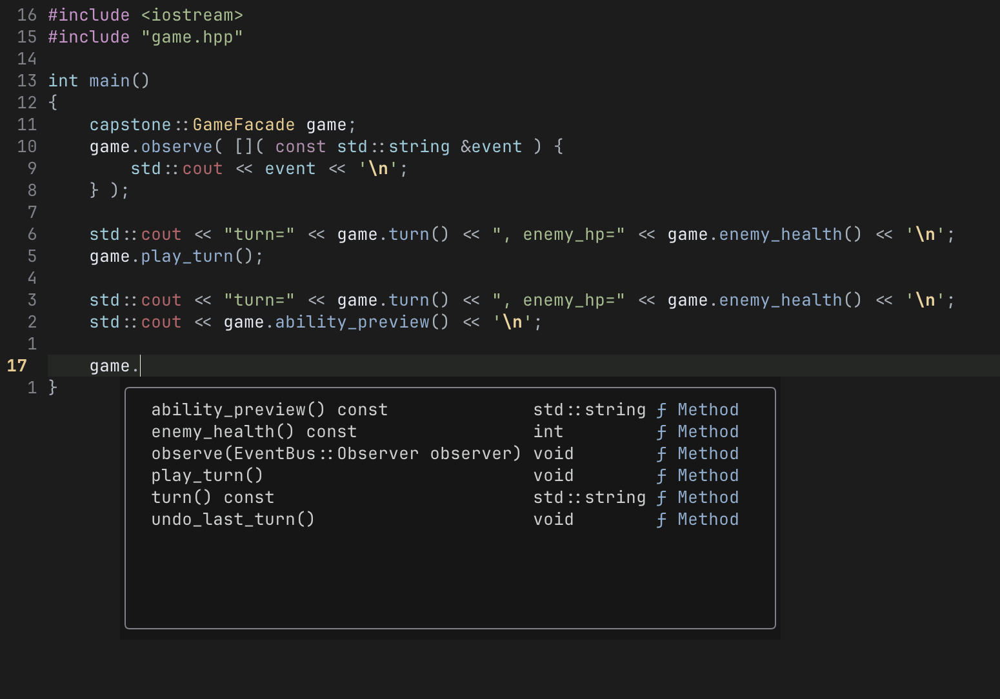
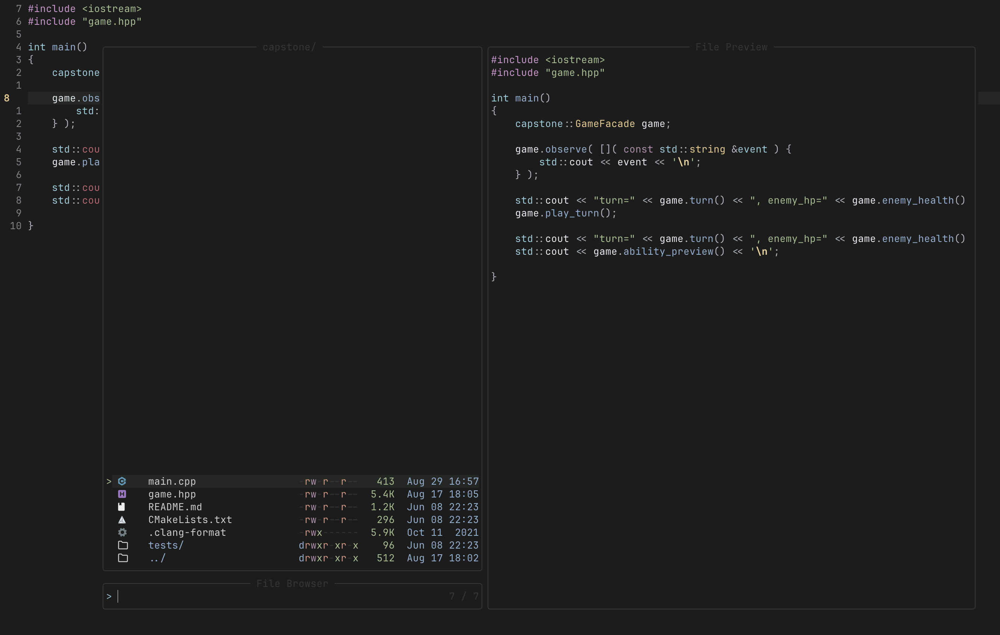

# Mastru Nvim Config

A small, modern Neovim configuration focused on an uncluttered editing experience.


## What is included

- Dark **Nordfox** theme, customized with graphite backgrounds and blue-grey selection surfaces.
- Relative line numbers, a visible cursor line, persistent undo, smart case search, and 4-space indentation.
- Built-in package management through `vim.pack` (no third-party plugin manager).
- Tree-sitter syntax parsing for C/C++, Python, JavaScript/TypeScript, HTML/CSS/JSON, Lua/Vim, and Markdown.
- Native LSP completion and navigation for C/C++, Python, JavaScript/TypeScript, HTML, and CSS.
- Telescope for finding files, searching project text, browsing buffers, opening help, recent files, and file browsing.
- Conform formatting for C/C++, Python, JavaScript/TypeScript, HTML, CSS, and JSON.
- Lualine status bar, Noice command-line / notification UI, rich Markdown rendering, and Papiro integration.

## Preview

### Code intelligence

LSP completion is enabled when an installed language server attaches to a buffer. Diagnostics and navigation are available directly in the editor.



### Project navigation

Telescope provides a fast, centered file picker and project search workflow.



## Requirements

- **Neovim 0.12+** — this configuration uses `vim.pack` and native LSP completion APIs from current Neovim.
- `git` — used by Neovim to fetch the plugins.
- `ripgrep` (`rg`) — recommended for Telescope live grep.
- The language-server and formatter executables you use. See [Language tooling](#language-tooling).
- A terminal font with Nerd Font glyphs is recommended for filetype and status-line icons.

## Install

> Back up an existing config before replacing it.

1. Clone this repository:

   ```sh
   git clone https://github.com/mastrudev/mastru-nvim-config.git
   ```

2. Move the cloned folder into Neovim's configuration location:

   ```sh
   mv mastru-nvim-config ~/.config/nvim
   ```

3. Start Neovim:

   ```sh
   nvim
   ```

On first launch, Neovim fetches the declared plugins. The included `nvim-pack-lock.json` records the package versions used by this configuration.

## Daily use

The leader key is `Space`. Press `Space` first, then the shortcut below.

| Shortcut | Action |
| --- | --- |
| `Space w` | Save the current file |
| `Space q` | Quit the current window |
| `Space f` | Format the current buffer |
| `Space f f` | Find files |
| `Space f g` | Search text in the project (requires `rg`) |
| `Space f b` | List open buffers |
| `Space f h` | Search Neovim help |
| `Space f r` | Open recent files |
| `Space f e` | Browse files from the current file's directory |
| `Space m p` | Open the Papiro floating view |
| `Ctrl-h/j/k/l` | Move between split windows |
| `Ctrl-Arrow` | Resize split windows |
| `Esc` | Clear search highlighting |

### LSP shortcuts

These become available in buffers where a language server is attached.

| Shortcut | Action |
| --- | --- |
| `gd` | Go to definition |
| `gD` | Go to declaration |
| `gr` | Find references |
| `gi` | Find implementations |
| `K` | Show hover documentation |
| `Space r n` | Rename symbol |
| `Space c a` | Code actions |
| `Space d s` | Document symbols |
| `Space w s` | Workspace symbols |

## Configuration map

| File | Responsibility |
| --- | --- |
| `init.lua` | Loads every configuration module in a deliberate order. |
| `lua/config/options.lua` | Editor behavior: numbers, indentation, search, splits, undo, completion, and rounded UI borders. |
| `lua/config/keymaps.lua` | Global leader key and everyday navigation, save, quit, and split shortcuts. |
| `lua/config/packages.lua` | Plugin declarations managed by Neovim's built-in `vim.pack`. |
| `lua/config/colors.lua` | Nordfox theme setup and its existing graphite/blue-grey palette. |
| `lua/config/icons.lua` | Dark-variant file icons from `nvim-web-devicons`. |
| `lua/config/treesitter.lua` | Installed parsers and Tree-sitter highlighting activation. |
| `lua/config/lsp.lua` | Language servers, native completion, and buffer-local LSP mappings. |
| `lua/config/telescope.lua` | Finder, live grep, buffers, help, recent files, and file browser. |
| `lua/config/format.lua` | Formatter selection and `Space f`. |
| `lua/config/statusline.lua` | Lualine status bar with Git, diagnostics, encoding, and position. |
| `lua/config/markdown.lua` | Rendered headings, checkboxes, code blocks, and comfortable prose editing. |
| `lua/config/noice.lua` | Floating command line, completion menu, LSP documentation, and notifications. |
| `lua/config/papiro.lua` | Papiro integration with a rounded floating view. |

## Language tooling

The following server names are enabled in `lua/config/lsp.lua`. Install the ones relevant to your projects and make sure their executables are on your `PATH`.

| Language | LSP server | Formatter |
| --- | --- | --- |
| C / C++ | `clangd` | `clang-format` |
| Python | `pyright`, `ruff` | `ruff format` |
| JavaScript / TypeScript | `ts_ls` | `prettier` |
| HTML | `html` | `prettier` |
| CSS | `cssls` | `prettier` |
| JSON | — | `prettier` |

The `ts_ls`, `html`, and `cssls` names are Neovim LSP configuration identifiers; their common executables are provided by `typescript-language-server` and the `vscode-langservers-extracted` package.

## Theme colors

The existing Nordfox overrides are defined in [`lua/config/colors.lua`](lua/config/colors.lua). The main choices are:

- `bg1`: editor background (`#1B1C1B`)
- `bg0`: darker floating/status background (`#151615`)
- `bg2`–`bg4`: raised UI surfaces
- `sel0`: subtle selection background (`#2D343A`)
- `sel1`: pearl-blue selection/accent surface (`#3D5667`)

Change these hex values to tune the editor while retaining the Nordfox syntax colors. The README's Blu Perla artwork is separate and does not change any of these values.

## Troubleshooting

- **Plugins do not appear:** confirm `nvim --version` reports 0.12 or later, then restart Neovim with network access available.
- **`Space f g` finds nothing:** install `ripgrep` and ensure `rg --version` works in your terminal.
- **LSP features are missing:** install the matching language-server executable and reopen the file. Use `:checkhealth vim.lsp` for Neovim diagnostics.
- **Icons look like squares:** configure your terminal to use a Nerd Font.
- **Formatting fails:** install the formatter named in the table above for the current filetype.

## Repository layout

```text
.
├── assets/                  # README visuals
├── init.lua                 # Configuration entry point
├── lua/config/              # Focused configuration modules
└── nvim-pack-lock.json      # Locked plugin revisions
```

## License

MIT. 
